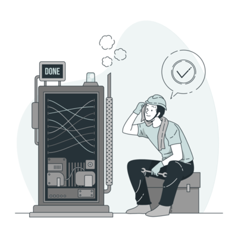

# Shark Stock

Este projeto foi iniciado [Repositório Shark Stock](https://github.com/sucoDeGoiaba/React_MOD5/tree/master/react-mod5).

## Descrição do Projeto

Este projeto foi realizado para fins didáticos como instrumento de avaliação final do Módulo 5 do curso WebDev Full Stack da [Resilia Educação](https://www.resilia.com.br/)! Sendo finalizado em Abril de 2022!

O projeto foi realizado em equipe com a proposta de desenvolver o front end em React da API construída como trabalho final do Módulo 4 (que também foi realizado em equipe). Em conjunto escolhemos o tema Loja de Infomática, e optamos pela entidade [Estoque](https://github.com/sucoDeGoiaba/apiMOD4), para utilizar esta entidade foi feito o deploy da entidade [Estoque](https://apimod4-infoshark.herokuapp.com/produtos), no site [Heroku](https://www.heroku.com). 

Fazia parte obrigatório no desenvolvimento deste os seguinte critérios:

    I - Utilizar endpoints da API que foi criada no Módulo 4 com [Node.JS](https://nodejs.org/en/), com a framework [Express](https://expressjs.com/) e como banco de dados o [SQLite](https://www.sqlite.org/index.html);
    II - Utilizar a biblioteca [react-router-dom](https://www.npmjs.com/package/react-router-dom);
    III - Tenha uma animação [CSS](https://developer.mozilla.org/pt-BR/docs/Web/CSS);
    IV - Contenha as funcionalidades básicas do CRUD:
        a. Página para listar os cadastros com opção de busca;
        b. Página para incluir um novo registro;
        c. Página para editar os cadastros;
        d. Opção de excluir itens cadastrados.

##  Pré-requisitos e como rodar a aplicação

  Para que nossa aplicação funcione adequadamente é necessário que usuário tenha instalado em seu dispositivo um browser de internet atualizado, e acessar com nesse link ??

## 🛠 Teconologias utilizadas

Para este projeto utilizado as seguintes ferramentas:

  
- [VS Code](https://code.visualstudio.com/)

- [JavaScript](https://www.javascript.com/)

- [CSS](https://www.w3.org/Style/CSS/#specs)

- [React](https://pt-br.reactjs.org/)

- [GitHub](https://github.com/)

- [Heroku](https://www.heroku.com)

- [API-Estoque](https://apimod4-infoshark.herokuapp.com/produtos)

- [WhatsApp](https://web.whatsapp.com/)

- [Discord](https://discord.com/)

- [Adobe Color](https://color.adobe.com/pt/create/color-wheel)

- [Canva](https://www.canva.com/)

## Autores

Fabiano Barros de Oliveira

[Linkedin](https://www.linkedin.com/in/fabiano-barros-de-oliveira-3aa12b82/)

[GitHub](https://github.com/fabianobarroli)

Felipe Paes de Melo

[Linkedin](https://www.linkedin.com/in/flppaesdemelo/)

[GitHub](https://github.com/sucoDeGoiaba)

Vivian Caroline Miranda

[Linkedin](https://www.linkedin.com/in/viviancaroline/)

[GitHub](https://github.com/viviancarolinemiranda)

  

Patrick Almeida

[Linkedin](https://www.linkedin.com/in/patrick-almeida-01b47422a/)

[GitHub](https://github.com/patrickovalmeida)

## Licença

  

  

Direitos autorais

  

A permissão é concedida, gratuitamente, a qualquer pessoa que obtenha uma cópia deste software e arquivos de documentação associados (o "Software"), para negociar no Software sem restrições, incluindo sem limitação os direitos de uso, cópia, modificação, fusão, publicação, distribuição, sublicença e/ou venda cópias do Software, e para permitir que as pessoas a quem o Software seja fornecido para fazê-lo, sujeitos às seguintes condições:

  

O aviso de direitos autorais acima e este aviso de permissão devem ser incluídos em todas as cópias ou partes substanciais do Software.

  

O SOFTWARE É FORNECIDO "COMO ESTÁ", SEM GARANTIA DE QUALQUER TIPO, EXPRESSO OU IMPLÍCITO, INCLUINDO, MAS NÃO SE LIMITANDO ÀS GARANTIAS DE COMERCIALIZAÇÃO, ADEQUAÇÃO PARA UM PROPÓSITO ESPECÍFICO E NÃO INFRINGEMENT. EM NENHUM CASO OS AUTORES OU DETENTORES DE DIREITOS AUTORAIS SERÃO RESPONSÁVEIS POR QUALQUER RECLAMAÇÃO, DANOS OU OUTRAS RESPONSABILIDADES, SEJA EM UMA AÇÃO DE CONTRATO, DELITO OU DE OUTRA FORMA, DECORRENTES, FORA OU EM CONEXÃO COM O SOFTWARE OU O USO OU OUTRAS NEGOCIAÇÕES NO SOFTWARE.

## Status do Projeto

Ilustrações de trabalho por Storyset (https://storyset.com/illustration/done/bro)